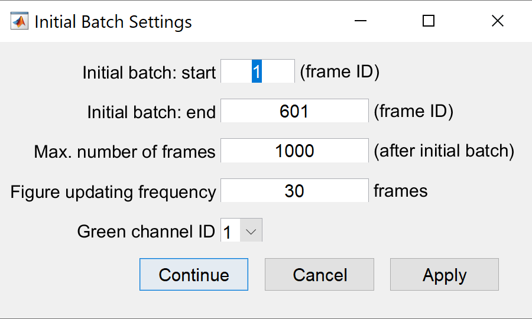

# NeuroART  

#### Real-Time Analysis of calcium imaging of neuronal population activity for informed closed-loop activities

## System Requirements:
- Anaconda 3 (optional, but required if you want to use the cite-on package for cell finding);
- Python 3.7 (or newer);
- MATLAB 2019b (or newer);
- MATLAB add-ons:
    - Image Processing Toolbox,
    - Statistics and Machine Learning Toolbox,
    - Bioinformatics Toolbox,
    - Parallel Computing Toolbox,
    - Signal Processing Toolbox,
    - MATLAB support for MinGW-w64 C/C++ Compiler (for Windows)
    - CATSTRUCT external function (https://www.mathworks.com/matlabcentral/fileexchange/7842-catstruct)
- Minimum of 10 Gb of space on hard drive;
- (Optional) NVIDIA GPU with CUDA 10.2

(Make sure all the relevant variables are added to the PATH.)
e.g. The following should be listed:
- C:\User\anaconda3\Library\bin\
- C:\User\anaconda3\Scripts\ 
- C:\User\anaconda3\

## Installation 

Clone this repository or download the folder that contains all the files required to run NeuroART.

### Modules

[CaImAn](https://caiman.readthedocs.io/en/master/index.html) should be already functional from the code.

#### Installing Cite-on for Windows (Optional):

Open cmd in the NeuroART folder and run the following commands:
- `git clone https://gitlab.iit.it/fellin-public/cite-on.git`
- `ren cite-on citeon` (Python doesn't like files with dashes.)
- `conda env create -f citeonEnv.yml`
- `conda activate citeon`
- `conda install libpython m2w64-toolchain -c msys2`
- `cd citeon`
- `python setup.py build_ext --inplace`
- `pip install .`

#### Installing Cite-on for Linux (Optional):

Open cmd in the NeuroART folder and run the following commands:
- `git clone https://gitlab.iit.it/fellin-public/cite-on.git`
- `ren cite-on citeon` (Python doesn't like files with dashes.)
- `conda env create -f citeonEnv.yml`
- `conda activate citeon`
- `cd citeon`
- `python setup.py build_ext --inplace`
- `pip install .`

#### Installing Cite-on for MacOS (in progress):

Open cmd in the NeuroART folder and run the following commands:
- `git clone https://gitlab.iit.it/fellin-public/cite-on.git`
- `mv cite-on citeon` (Python doesn't like files with dashes.)
- `conda env create -f citeonEnv.yml`
- `conda activate citeon`
- `conda install libpython-static -c msys2`
- `cd citeon`
- `python setup.py build_ext --inplace`
- `pip install .`

## Imaging system specific guidelines

# If imaging is done using ScanImage:
In this case, a global variable needs to be added to the ScanImage MATLAB script that serves as the file identifier to the raw file that saves the images during live acquisition. Furthermore, three more lines of code (as shown below) need to be added to the ScanImage software to write each acquired frame to the designated raw file (in 16 bit unsigned integer format) during imaging. Make sure that the "save" checkbox in scanimage is unchecked, as we are writing the frames to a separate "raw" file. You will also have to find the z focus for imaging, prior to the start of this experiment.

If you need to perform real-time photostimulation, make sure to add the corresponding calibration file to the "calibration" subfolder. This calibration file should contain the coordinate transformation from the imaging plane to the coordinates used by the SLM (Spatial Light Modulator) or the DMD (Digital Micromirror Device).

# If imaging is done using a Bruker Ultima 2P+ microscope:
Bruker Ultima microscopes do not allow users to access image files during live acquisition. Furthermore, their proprietary image format makes it difficult to read in real-time. Therefore, we provide a separate MATLAB function (“BrukerReadWriteRaw.m”) that is used to transfer images acquired through the PrairieView software to the analysis computer via a TCP/IP link. Each of these frames are saved to a single raw binary file (16 bit unsigned integer format), which is accessed by NeuroART during imaging (detailed instructions are provided in the attached readme file).

# If imaging is done using a Thorlabs B-Scope (Bergamo II series, B248):
In this case you have to save the image frames captured through the ThorImage software to a single raw binary file in 16 bit unsigned integer format.

## Instructions for Running the NeuroART application

1. Open the NeuroART folder in MATLAB;
2. Run the main script "main.m";
3. The first time you run NeuroART, NeuroART/neuroArtConfig.json will be created. Update NeuroART/neuroArtConfig.json if you need to specify your python path as well as default parameters. The fields you should change are:
  - Default dialog values via `neuroArtConfig.default`
  - Path to the complex_dynamics python toolbox via `neuroArtConfig.python.complex_dynamics_path` (optional)
3. The first input dialog will appear on the screen as shown below.

- *Average neuron radius*: in microns
- *DF/F display width*: The number of frames of which you would like to observe the ΔF/F traces at a given time. (i.e., The length of the ΔF/F traces to be displayed in the app window). Please make sure that this number does not exceed the number of frames you are planning to collect as the initial batch for identifying cell coordinates.
- *Experiment ID*: Output variables will be saved as a .mat file under this name.
- *Image folder*: The folder where the image frames will be saved in real-time. You will be prompted to select the folder once you click on this text field.
- *Image file name*: The name of the image file (This can be either a RAW file or a TIF stack). It is not necessary to have this file while providing input parameters. The app will wait until this file appears in the folder specified as the “Image folder”. Do not include the file extension here, only type the name of the file.
- *Image format*: RAW/TIF
- *Imaging system*: The name of the imaging system. If all the frames are already available and you only need to analyze data, please select “Offline Mode”.
- *Number of channels*: For single channel data, select 1. Otherwise, select the number of channels available in the acquired images.
- *Analyzing Receptive Fields?* Select “Yes” if you are planning to perform tuning analysis and the required files are available.
- *Red Channel Available?* Select “Yes” if you are using red channel (static channel) for cell detection. 
- *Cell Finding Method*: Four options available for cell finding: Manual, CaImAn, Cite-On, and from file (previously saved coordinates)
- *Stimulation*: By default, this property is set to "None". Currently, NeuroART supports Boulder Nonlinear Systems SLM, PraireLink, and Mightex Polygon DMD, for photostimulation. Select these options only if they are available and already calibrated.
- *ROI Type*: By default, this app performs calcium image analysis on the entire cell bodies. If you want to analyze donut shaped (not filled) regions of interest (ROIs) around each of the identified cells (neurons), select “Not Filled”
- *Network Analysis Method*: During the real-time analysis loop, the app will rank the cells according to their degree in the functional network, which is derived based on the correlation between each pair of ΔF/F traces. Currently, we derive this network based on two algorithms, minimum spanning tree method (“MST”) and the correlation threshold method (“Correlations”). Select the method you prefer.
- *Correlation Analysis Window*: By default, correlations are calculated for a cumulative window (consider all the frames acquired until the latest frame). However, if you want to only consider short term correlations between the ΔF/F traces, select “Fixed”. Otherwise, select “Cumulative” to continue the analysis on a cumulative window.
- *Correlation Window Size*: If you selected “Fixed” above, please specify the preferred window size
(in seconds).

After inputting all the parameters, click “Continue”.

4. If you selected CaImAN as the cell finding method, you will be directed to a separate window asking for the parameters to be used by the CaImAn cell finder. If you are satisfied with the default parameters, click "OK". Otherwise, modify the parameters before clicking "OK".

5. Next, specify the initial batch of frames (IDs of starting and ending frames) for cell identification. Make sure that the *length of the initial batch* is greater than or equal to the *DF/F display width*. Also, provide the *maximum number of frames* that will be collected during the experiment. This will be used as an upper bound for the total number of frames. Therefore, just provide an approximate number for this field.

- *Figure updating frequency*: How frequently the figures/plots need to be updated in the GUI. (e.g., every 30 frames)
- *Green channel ID*: For single channel data this field will be set to 1. For multi-channel data, specify which channel is the green channel. (e.g., Consider a two-channel dataset where the green channel is the second one. Then, green channel ID = 2)

5. If you selected “Yes” for analyzing receptive fields, you will be prompted to locate the “thorSync”
file and the “pSignal” file. 

6. Make sure that the image acquisition has started. Wait until the app recognizes the image files and the initial batch of frames. If you opted for using the red (static) channel for cell identification, you will be prompted to provide the directory path and the file identifier for red channel data.

7. If you selected the manual cell finding method on step 3, here you will manually select the cells which are visible in the mean image. Click on all the cell centers that you would like to analyze and press the “Enter” key once cell clicking is complete. Press the “delete” key if you want to undo the previous click.

8. Wait until all the frames in the initial batch are motion corrected, denoised and ΔF/F traces are calculated for all the identified cells. After completion of these steps, Real-time visualization will start. 

9. Select, “Start Real Time Analysis”
to continue with the real-time analysis!

10. The figure below indicates different features of the NeuroART GUI, which can be useful during the real-time analysis.

Use the slider at the bottom left corner to adjust the correlation analysis window size while the images are being acquired.
Tuning analysis module can be turned on/off using the checkbox in the GUI.

11. After the completion of an experiment, all the frames can be saved with labels in the TIF file format. (This is optional)

12. After closing the app window, all the output variables can be found in a .mat file under the name
provided as “Experiment ID”.

